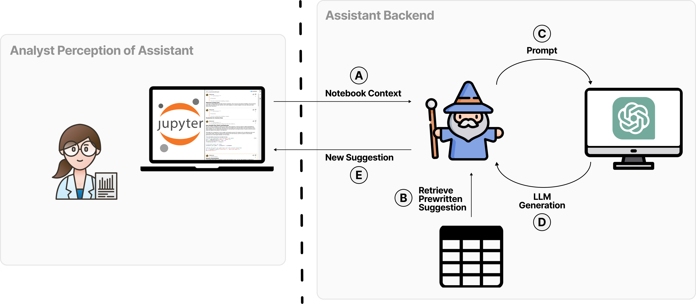
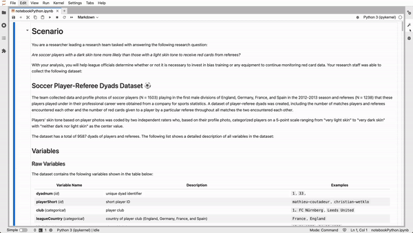
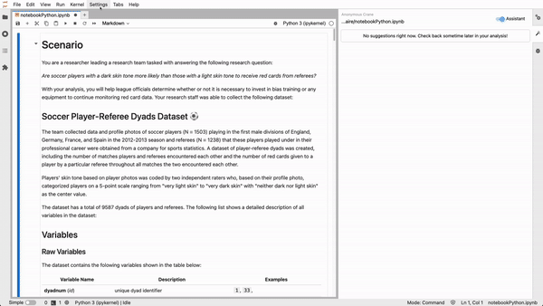

# Data Analysis Assistant Interface

This repository contains the code for the [CHI 2024 publication](https://arxiv.org/abs/2309.10108), _How Do Data Analysts Respond to AI Assistance? A Wizard-of-Oz Study_. Specifically, the code contains the wizard and user interface used to conduct the study.

If code is useful to your project, please consider citing our paper!

```bibtex
@article{Gu2023HowDD,
  title={How Do Data Analysts Respond to AI Assistance? A Wizard-of-Oz Study},
  author={Ken Gu and Madeleine Grunde-McLaughlin and Andrew M. McNutt and Jeffrey Heer and Tim Althoff},
  journal={Proceedings of the 2024 CHI Conference on Human Factors in Computing Systems},
  year={2024},
  url={https://api.semanticscholar.org/CorpusID:262054482}
}
```

## Abstract


Data analysis is challenging as analysts must navigate nuanced decisions that may yield divergent conclusions. AI assistants have the potential to support analysts in planning their analyses, enabling more robust decision-making. Though AI-based assistants that target code execution (e.g., Github Copilot) have received significant attention, limited research addresses assistance for both analysis execution and planning. In this work, we characterize helpful planning suggestions and their impacts on analysts' workflows. We first review the analysis planning literature and crowd-sourced analysis studies to categorize suggestion content. We then conduct a Wizard-of-Oz study (n=13) to observe analysts' preferences and reactions to planning assistance in a realistic scenario. Our findings highlight subtleties in contextual factors that impact suggestion helpfulness, emphasizing design implications for supporting different abstractions of assistance, forms of initiative, increased engagement, and alignment of goals between analysts and assistants.

## Basics

The code adapts the [jupyterlab-comments](https://github.com/jupytercalpoly/jupyterlab-comments) Jupyterlab [extension](https://jupyterlab.readthedocs.io/en/stable/extension/extension_dev.html) for our Wizard of Oz study. We implement two modes: **analysts mode** and **wizard mode**. There is a front-end and back-end component to the extension.

### Analyst Mode



Analyst mode is what analysts see: a standard jupyter lab notebook interface with a side-panel in which analysis suggestions are raised. See the fig above.

### Wizard Mode



Wizard mode can be toggled in the settings tab in the top bar. In wizard mode,the wizard can select a notebook cell or code snippet to use as suggestion context which opens a suggestion card for the wizard to write suggestions in markdown. The wizard can toggle whether the suggestion is shown by clicking on the avatar in the suggestion card. Finally, the wizard can save the suggestion.

Upon saving, an underlying comment file is updated. The extension in analyst mode polls this file and updates its side-panel with updated suggestions.

## Setup

### Requirements

- JupyterLab >= 3.1.6

On MAC OSX, it works with jupyterlab version 3.5.2

**Update 02/26/2023**
(does not work with jupyterlab 3.6.1)

### Environment

```
conda create --name assistant-interface python=3.8
conda activate assistant-interface
conda install -c conda-forge r-irkernel -y
conda install -c conda-forge nodejs=18.7.0 -y

./build_development.sh
```

#### Dev Install

Note: You will need NodeJS to build the extension package.

The `jlpm` command is JupyterLab's pinned version of
[yarn](https://yarnpkg.com/) that is installed with JupyterLab. You may use
`yarn` or `npm` in lieu of `jlpm` below.

The code below is included in `./build_development.sh`

```bash
# Clone the repo to your local environment
# Change directory to the jupyterlab_comments directory
# Install package in development mode
pip install -e .
# Link your development version of the extension with JupyterLab
jupyter labextension develop . --overwrite
# Rebuild extension Typescript source after making changes
jlpm run build
```

You can watch the source directory and run JupyterLab at the same time in different terminals to watch for changes in the extension's source and automatically rebuild the extension.

```bash
# Watch the source directory in one terminal, automatically rebuilding when needed
jlpm run watch
# Run JupyterLab in another terminal
jupyter lab
```

With the watch command running, every saved change will immediately be built locally and available in your running JupyterLab. Refresh JupyterLab to load the change in your browser (you may need to wait several seconds for the extension to be rebuilt).

By default, the `jlpm run build` command generates the source maps for this extension to make it easier to debug using the browser dev tools. To also generate source maps for the JupyterLab core extensions, you can run the following command:

```bash
jupyter lab build --minimize=False
```

### Debugging

#### Setting up VsCode Debugging

```
pip install cookiecutter
cookiecutter gh:jupyterlab/debug-config-cookiecutter -f
```

Fill out the subsequent prompts (below is an example)

```
You've downloaded /Users/qikungu/.cookiecutters/debug-config-cookiecutter before. Is it okay to delete and re-download it? [yes]: yes
project_name [myextension]: jupyter_comments
has_envfile [n]: n
virtual_env_root []: /Users/qikungu/miniforge3/envs/jupyter_codex/
chrome_bin_path []:
vscode_config_path [.vscode]:
```

This will genereate a `.vscode` folder with `debug.env`, `launch.json`, and `settings.json` inside. Set webroot to the parent dir of your project's top level package.json (`"${workspaceFolder}"` should work fine). Also set `notebook-dir` in `launch.json` to the directory where you want jupyter lab to open in.

#### How to get debugging to point to typescript files insdead of javascript files

**Example Directory Structure for JupyterLab Extension Directory**

```
# generated using "tree -L 2 -I node"
├── LICENSE
├── MANIFEST.in
├── README.md
├── RELEASE.md
├── comments
│   └── 1101282109.comment
├── install.json
├── jupyter-config
│   ├── nb-config
│   └── server-config
├── jupyterlab_codex
│   ├── __init__.py
│   ├── __pycache__
│   ├── _version.py
│   ├── handlers.py
│   └── labextension
├── jupyterlab_codex.egg-info
│   ├── PKG-INFO
│   ├── SOURCES.txt
│   ├── dependency_links.txt
│   ├── not-zip-safe
│   ├── requires.txt
│   └── top_level.txt
├── lib
│   ├── codex.d.ts
│   ├── codex.js
│   ├── codex.js.map
│   ├── handler.d.ts
│   ├── handler.js
│   ├── handler.js.map
│   ├── icon.d.ts
│   ├── icon.js
│   ├── icon.js.map
│   ├── index.d.ts
│   ├── index.js
│   ├── index.js.map
│   ├── toolbar.d.ts
│   ├── toolbar.js
│   └── toolbar.js.map
├── node_modules
├── package-lock.json
├── package.json
├── poetry.lock
├── pyproject.toml
├── schema
│   └── plugin.json
├── setup.py
├── src
│   ├── codex.ts
│   ├── handler.ts
│   ├── icon.ts
│   ├── index.ts
│   └── toolbar.ts
├── style
│   ├── base.css
│   ├── index.css
│   └── index.js
├── tsconfig.json
├── tsconfig.tsbuildinfo
├── webpack.config.js
└── yarn.lock
```

1. Try to match the following `tsconfig.json`

```json
{
  "compilerOptions": {
    "allowSyntheticDefaultImports": true,
    "composite": true,
    "declaration": true,
    "esModuleInterop": true,
    "incremental": true,
    "jsx": "react",
    "module": "esnext",
    "moduleResolution": "node",
    "noEmitOnError": true,
    "noImplicitAny": true,
    "noUnusedLocals": true,
    "preserveWatchOutput": true,
    "resolveJsonModule": true,
    "outDir": "lib",
    "rootDir": "src",
    "strict": true,
    "sourceMap": true,
    "strictNullChecks": true,
    "target": "es2017"
  },
  "include": ["src/*"]
}
```

Specifically, we want to set `sourceMap`: `True`. This will create `codex.js.map`, `handler.js.map` files w`.map` ending in the `lib` folder which maps between javascript and typescript.

2. Add a `webpack.config.js` file and which should have the following contents

```js
module.exports = {
  module: {
    rules: [
      {
        test: /\.js$/,
        enforce: 'pre',
        use: ['source-map-loader']
      }
    ]
  }
};
```

3. If necessary install `source-map-loader` which will be in the `node_modules` folder. (see [source-map-loader | webpack](https://webpack.js.org/loaders/source-map-loader/))
4. Update `package.json` in which the key `jupyterlab` we will have `webpackConfig: webpack.config.js`.

**Summary**

1. set `sourceMap: True` in `tsconfig.json`
2. create `webpack.config.js` with the above contents if it does not exist already
3. make sure `source-map-loader` is installed
4. update `package.json`
5. `jlpm run build`

```json
//package.json file
{
  "jupyterlab": {
    "discovery": {
      "server": {
        "managers": ["pip"],
        "base": {
          "name": "jupyterlab_codex"
        }
      }
    },
    "extension": true,
    "outputDir": "jupyterlab_codex/labextension",
    "schemaDir": "schema",
    "webpackConfig": "webpack.config.js"
  }
}
```

## Server Extension Install

Everytime we make changes to the server (the python files) we need to do the following:

```
# Install package in development mode
pip install -e .
# Link your development version of the extension with JupyterLab
jupyter labextension develop . --overwrite
# Enable the server extension
jupyter server extension enable jupyterlab_comments
# Rebuild extension Typescript source after making changes
jlpm run build
```

See [extension-examples/server-extension at master · jupyterlab/extension-examples](https://github.com/jupyterlab/extension-examples/tree/master/server-extension#the-template-folder-structure)

## Uninstall

In development mode, you will also need to remove the symlink created by `jupyter labextension develop`
command. To find its location, you can run `jupyter labextension list` to figure out where the `labextensions`
folder is located. Then you can remove the symlink named `jupyterlab-comments` within that folder.
