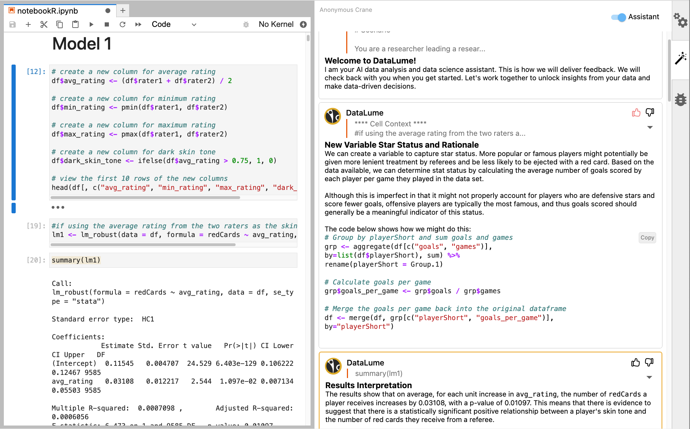

## AI-Analyst Collaboration Study

We are a team of AI/HCI researchers who are developing a data analysis assistance tool. The tool primarily looks at the content of one’s analysis and provides suggestions that may help the analysis process. 
We want to learn how our prototype could integrate with your analysis workflow. In this study we will work in a JupyterLab setting and perform our analysis in jupyter notebooks. 
For us to compare observations across participants, we will be working on pre-selected analaysis question/dataset. 

We call our prototype DataLume.

## Introduction to tool

For now, let's learn the workflow of how to interact with suggestions from DataLume. 

### Opening the sidebar panel
This is where you can see suggestions from DataLume

This will open the panel below.

### Any new suggestions will show with a yellow highlight

You can copy the code, give a thumps up or down. The suggestions also references the relevant context for the suggestions.

### FAQ
**Q**: What does the tool read as context information?

**A**: The tool reads both markdown and code and internally decides upon what is most relevant to use for suggestions. The blurb at the beginning of the notebook helps the tool understand the context of the analysis task but it can also infer this from the analysis itself.

